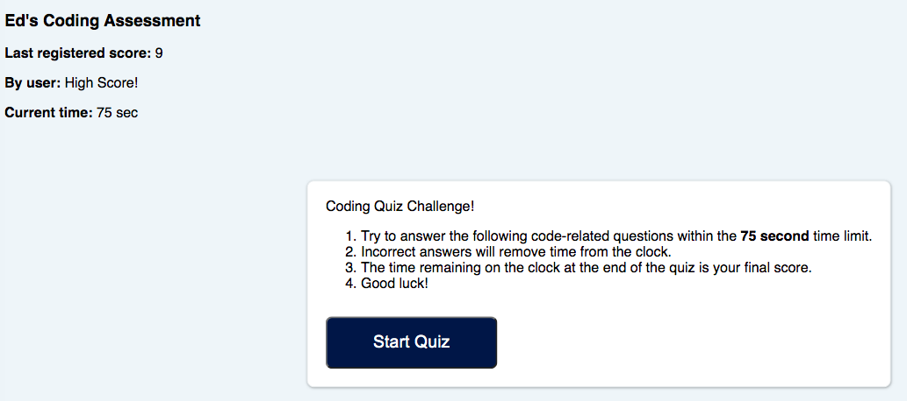

# API Code Quiz
 
## Description
This webpage was created so a user could take a timed quiz that removes time from the countdown clock if they get a question wrong. Whatever their remaining time is at the end of the quiz will be their score. 

They can enter their initials and have their score logged.

They can see their score and initials, clear it from local storage if they desire, and also see the previsous users scores/initials. Clear scores, and play again options will be available.  
 
## Table of Contents
- [Installation](#installation)
- [Criteria Checks](#criteria)
- [Usage and Coding](#Usage/coding)
- [Screenshots](#screenshots)
- [Credits](#credits)
- [License](#license)
## Installation
Clone or download this repository on GitHub then open "edoliva.github.io/WebAPIsCodeQuiz/" in a browser.  
## Criteria
- The user must click the Start Quiz button to move on from the information box to the quiz.
- The user must choose an answer and then click next question to move on to the next question.  
- The user must enter initials when prompted to submit their score and move on to the highscores box.
## Usage/coding:
- This HTML, CSS and JS were written to allow for a clean user experience. The general logic is as follows:
   - A user loads the webpage and is presented with an information box. The box includes the rules as well as a Start Quiz button. If there were previous scores the initials and score would display in the top left of the webpage.
   - A user presses the Start Quiz button to begin the quiz. The 75 second countdown clock begins. The information box is set to "display:none" in CSS, the quiz question box is chaged from "display:none" to "display:inline".
   - The question box pulls the question and 4 answer choices from an array of objects in the JS file. If the user selects a correct answer, the footer will display "Your answer is: Right.". If the user selects a wrong answer, the footer will display "Your answer is: Wrong! -10 sec" and then 10 seconds will be deducted from the countdown clock.  
   - The user presses Next Question button and the next object from the question array is displayed. It will do this up until the last question. A user cannot move to the next question until they select an answer.
   - Once all questions are answered the final score box will display, the time remaining on the clock will be logged as the users score, and the user will be prompted to enter their initials. A user cannot move to the highscore box until they enter initials. On Submit, the entered initials and score will display in the top left as the last recorded score. 
   - The user presses the Submit button and the highscore box is displayed with the top 5 scores (if they exist). The user can clear out all the scores if they would like. They can also play again. 
 
Screenshots:
-

-
If user leaves answer blank:
-

-
If user leaves initials blank:
-

-
Console Logged:
- The correct answer and user inputs will console.log. It will also indicate right or wrong.
- If this were a final product quiz, this would be removed to prevent cheating. For information purposes it is left in for this demo.

 
## Credits
Shoutout to our instructor Anthony and TA Tom! As well as everyone at Trilogy Education for making the content and grading our assignments.
 
## License
© 2021 Edmond Oliva.
Confidential and Proprietary. All Rights Reserved.
---
